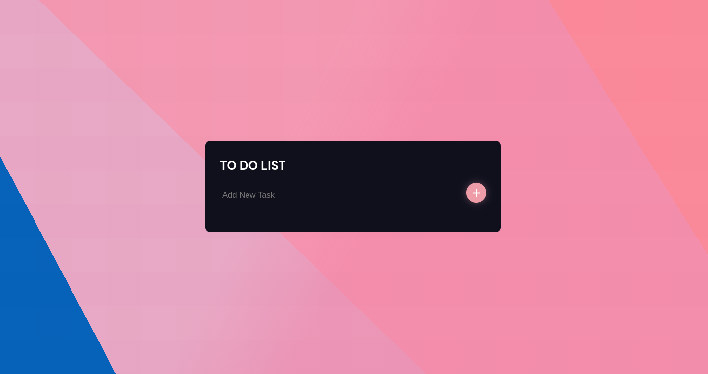

<h1 align="center">Task com Typescript</h1>

 
        <a href="#-tecnologias">Tecnologias</a>&nbsp;&nbsp;&nbsp;&nbsp;&nbsp;&nbsp;
        <a href="#-projeto">Projeto</a>&nbsp;&nbsp;&nbsp;&nbsp;&nbsp;&nbsp;
        <a href="#-layout">Layout</a>&nbsp;&nbsp;&nbsp;&nbsp;&nbsp;&nbsp;
        <a 
        <a href="#-referencias">Referências</a>&nbsp;&nbsp;&nbsp;&nbsp;&nbsp;&nbsp;
        <a href="#-referencias">

 

    

 

## 🚀 Tecnologias

Esse projeto foi desenvolvido com as seguintes tecnologias:
    - HTML, CSS e SCSS
    - Sass
    - Typescript
    - Babel e Webpack
    - Node.js
    - nodemon

## ⚙️ Instalação e Configuração

### Passo 1: Clonar o repositório

    https://github.com/FabioHenriqueFarias/Task

### Passo 2: Entrar no projeto
    cd task

### Passo 3: Iniciar projeto
    npm run server

### Outros Comandos

    npm run build:client

<em style="font-family: 'Helvetica', sans-serif, color: #38a138;">Este comando é usado para compilar o código TypeScript do cliente em código JavaScript</em> 

    
## 💻 Projeto

O Piano é um projeto que simula um teclado de forma digital.

## 📩 Layout
Você pode visualizar o layout do projeto através [DESSE LINK](https://task-fabio-farias.netlify.app/).

## 📚 Referências

Referências do projeto.

[@Eliteware](https://codepen.io/Eliteware/pen/wDHIC)    
[@gabrielcarol_](https://codepen.io/gabrielcarol/pen/rGeEbY)